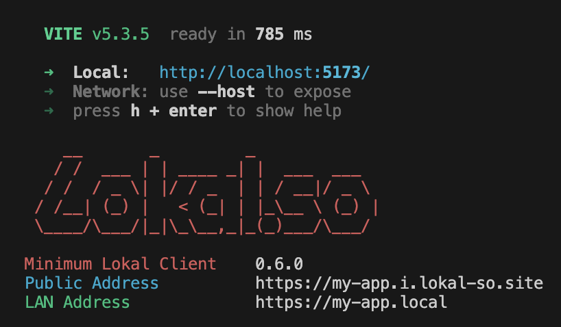
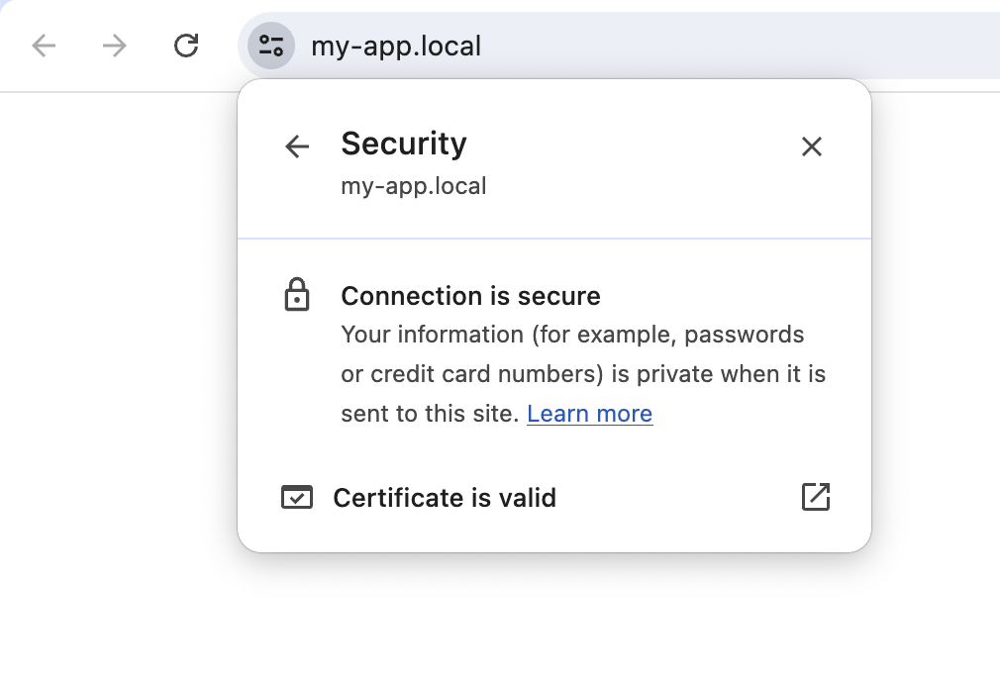

# Lokal Vite Plugin

Vite Plugin for Lokal JS/TS client

| CLI Preview | Browser Preview |
|---|---|
|   |  |

## Installation

```sh
npm i lokal-vite-plugin
```

## Usage

```javascript
// vite.config.js
import { defineConfig } from 'vite';
import lokalTunnel from 'lokal-vite-plugin';

export default defineConfig({
	plugins: [lokalTunnel({
		tunnelName: "my app",
		lanAddress: "my-app.local"
	})]
});
```

## License

MIT
